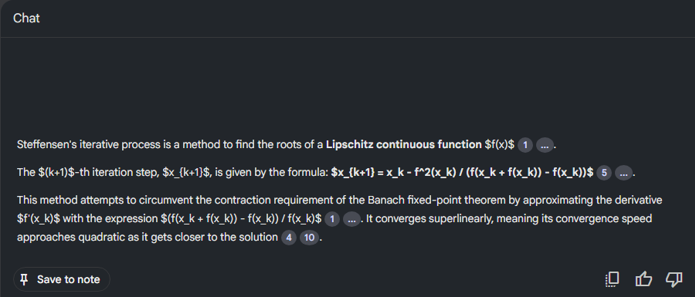
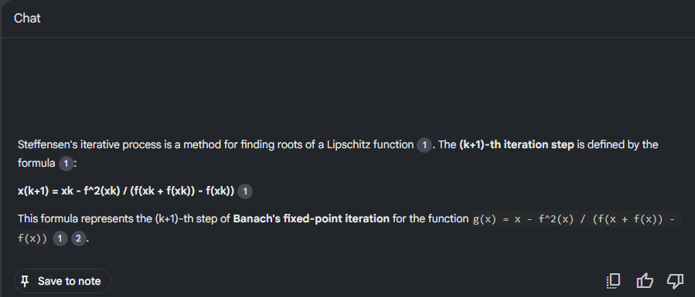

# Notebooklm Formula supported Extension

A Chrome Extension for NotebookLM that automatically renders LaTeX math expressions using KaTeX for improved readability.

Note: this readme is AI generated 💀

## Features

- Automatically detects and renders LaTeX math expressions (`$...$`, `$$...$$`, `\(...\)`, `\[...\]`) in NotebookLM notes and responses.
- Skips rendering inside code blocks, textareas, and other editable fields to avoid interfering with editing.
- Supports both inline and display math.
- Fast and lightweight, using KaTeX.

## Screenshots

**Before installing the plugin:**

**After installing the plugin (fixes the formulas!):**

## Installation

1. Clone or download this repository.
2. In Chrome, go to `chrome://extensions/`.
3. Enable "Developer mode" (top right).
4. Click "Load unpacked" and select the repository folder.

## Usage

1. Open NotebookLM in Chrome.
2. Math expressions in your notes and responses will be automatically rendered.
3. Edit your notes as usual; rendering will not interfere with editable fields.

## Troubleshooting

- If math is not rendered, reload the NotebookLM page.
- If rendering interferes with editing, check for updates or adjust ignored classes/tags in `content.js`.
- For interface changes, update selectors or logic in `content.js`.

## License

MIT License
